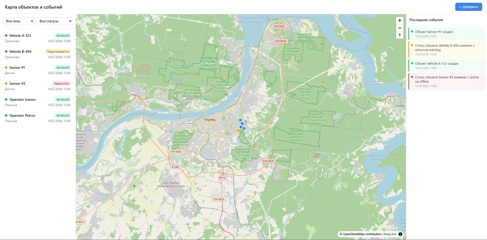
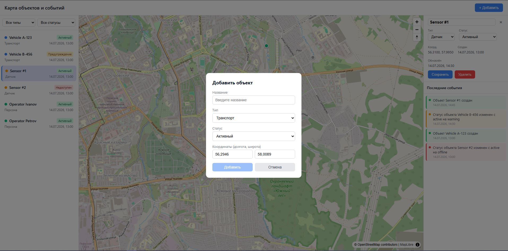
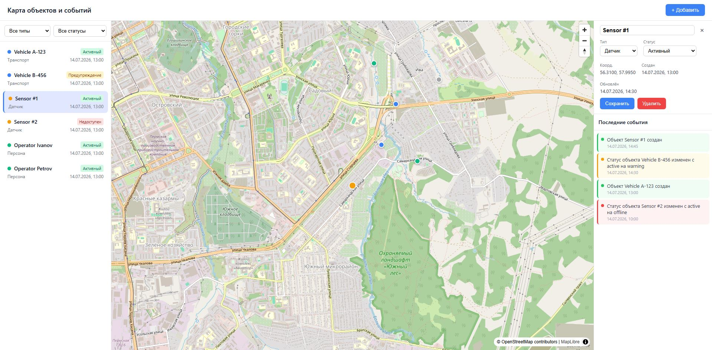
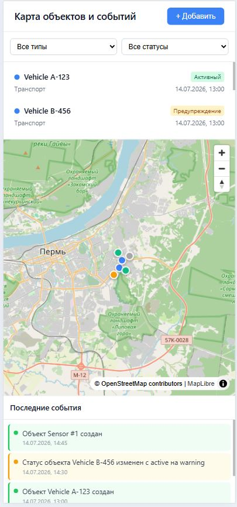
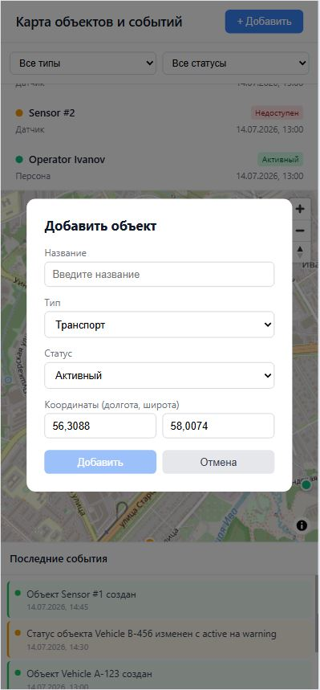
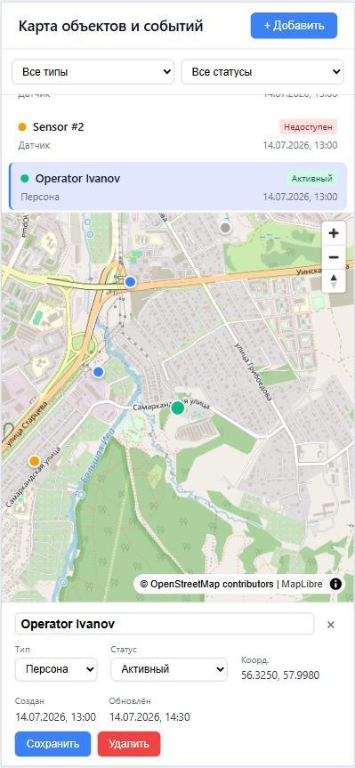

# Карта объектов и событий

Мини-приложение с интерактивной картой, боковой панелью объектов, панелью
последних событий и backend API на Express + PostgreSQL.


> [Ссылка на задание (TASK.md)](TASK.md)

## Внешний вид приложения

### Десктоп





### Мобильные устройства





## Технологии

| Слой | Технология | Почему |
|------|-----------|--------|
| Monorepo | npm workspaces | Единый `npm install` и запуск front/back из корня без сторонних оркестраторов |
| Frontend | Vue 3 + Composition API (`<script setup>`) | Реактивность, лаконичный код, строгая типизация |
| Карта | MapLibre GL | Open-source, растровые тайлы OSM, без ключей |
| Состояние | Pinia | Официальный стор Vue 3, удобен для списка/выделения/фильтров |
| HTTP | Axios | Типизированный API-клиент + обработка ошибок |
| Валидация (front) | Zod | Runtime-проверка данных, приходящих из API (type guards) |
| Сборка | Vite 8 | Быстрый dev-сервер с HTTPS + прокси `/api` |
| Backend | Node.js + Express | Простой и проверенный фреймворк |
| БД | PostgreSQL | Надёжность, типизированные координаты (массив `NUMERIC`) |
| Валидация (back) | Zod | Runtime validation + inference типов DTO |
| Тесты | Vitest + @vue/test-utils | Юнит-тесты чистых функций, сервисов, сторов и UI-компонентов |

## Структура проекта (monorepo)

```
map-objects-full/
├── package.json            # корень = workspace root (workspaces: [frontend, backend])
├── package-lock.json       # единый lockfile
├── docker-compose.yml      # postgres + backend + frontend (nginx)
├── screenshots/            # скриншоты UI для README
│   ├── Start mof PC.JPG
│   ├── Add object PC.JPG
│   ├── Select object PC.JPG
│   ├── Start mof Mobile.JPG
│   ├── Add object Mobile.JPG
│   └── Select object Mobile.JPG
├── backend/
│   ├── Dockerfile
│   ├── .env.example
│   ├── src/
│   │   ├── db/             # Пул PG + инициализация БД
│   │   ├── errors.ts       # AppError / ValidationError
│   │   ├── index.ts        # Express-приложение (CORS, JSON, middleware ошибок)
│   │   ├── server.ts       # точка входа (listen + init DB)
│   │   ├── mappers/        # Преобразование DB row → entity
│   │   │   ├── map-event.mapper.ts
│   │   │   └── map-object.mapper.ts
│   │   ├── repository/     # Data Access Layer — SQL запросы к PostgreSQL
│   │   │   ├── map-event.repository.ts
│   │   │   └── map-object.repository.ts
│   │   ├── routes/         # маршрутизация HTTP
│   │   │   ├── map-events.routes.ts
│   │   │   └── map-objects.routes.ts
│   │   ├── schemas/        # Zod-схемы валидации входных данных
│   │   ├── services/       # бизнес-логика
│   │   │   ├── map-event.service.ts
│   │   │   └── map-object.service.ts
│   │   └── types/
│   │       ├── enum-types.ts         # Union-типы: MapObjectType, MapObjectStatus, EventSeverity
│   │       ├── dto/                  # DTO для входных данных
│   │       │   ├── map-event.dto.ts
│   │       │   └── map-object.dto.ts
│   │       └── entity/               # Domain entities
│   │           ├── map-event.entity.ts
│   │           └── map-object.entity.ts
│   └── tests/            # тесты бэкенда (vitest)
└── frontend/
    ├── Dockerfile
    ├── nginx.conf          # раздача статики + прокси /api -> backend
    ├── src/
    │   ├── schemas/        # Zod-схемы DTO + ApiValidationError
    │   │   ├── map-event.schema.ts
    │   │   ├── map-object.schema.ts
    │   │   └── validation-errors.ts
    │   ├── services/       # API-клиенты (mock + remote) + интерфейсы
    │   │   ├── client.api.ts           # Axios instance
    │   │   ├── services-factory.ts     # выбор mock/remote по VITE_USE_MOCKS
    │   │   ├── interfaces/             # контракты сервисов
    │   │   │   ├── map-event.api.service.ts
    │   │   │   └── map-object.api.service.ts
    │   │   ├── map-event/              # события: remote + mock
    │   │   │   ├── index.ts
    │   │   │   ├── mock-map-event.service.ts
    │   │   │   └── remote-map-event.service.ts
    │   │   └── map-object/             # объекты: remote + mock
    │   │       ├── index.ts
    │   │       ├── mock-map-object.service.ts
    │   │       └── remote-map-object.service.ts
    │   ├── stores/          # Pinia (useObjectsStore, useEventsStore)
    │   ├── types/           # TypeScript типы
    │   │   ├── enum-types.ts         # Union-типы
    │   │   ├── dto/                  # DTO (формат API)
    │   │   │   ├── map-event.dto.ts
    │   │   │   └── map-object.dto.ts
    │   │   └── model/                # Model (UI-представление)
    │   │       ├── map-event.model.ts
    │   │       └── map-object.model.ts
    │   ├── utils/          # утилиты и мапперы
    │   │   ├── helpers.ts              # форматирование, метки/цвета
    │   │   ├── map-view.helpers.ts     # hexToRgba, markerStyle, createPopupContent
    │   │   ├── map-event-mappers.ts    # DTO → MapEvent model
    │   │   └── map-object-mappers.ts   # DTO → MapObject model
    │   ├── components/     # Vue-компоненты (UI)
    │   │   ├── AddForm.vue
    │   │   ├── EventPanel.vue
    │   │   ├── MapView.vue
    │   │   ├── ObjectCard.vue
    │   │   └── ObjectList.vue
    │   ├── App.vue
    │   └── main.ts
    └── tests/           # тесты фронтенда (vitest + @vue/test-utils)
```

_frontend_ и _backend_ — независимые workspace-пакеты; общих зависимостей нет
(валидация Zod продублирована осознанно — см. Trade-offs).

### Слои frontend (подробно)

- **types/** — разделены на `model/` (то, с чем работает UI: `MapObject`, `MapEvent`) и
  `dto/` (формат ответа API: `MapObjectDto`, `MapEventDto`). `enum-types.ts` — единый источник union-литералов.
- **schemas/** — Zod-схемы для DTO (`map-object.schema.ts`, `map-event.schema.ts`) и `ApiValidationError`
  (`validation-errors.ts`). Используются как **runtime type guards** при парсинге ответов API в remote-сервисах.
- **utils/**
  - `helpers.ts` — `formatDateTime`, метки/цвета по union-типам (`TYPE_LABELS`,
    `STATUS_LABELS`, `TYPE_COLORS`, `SEVERITY_COLORS`), `getSeverityColor`.
  - `map-object-mappers.ts` / `map-event-mappers.ts` — преобразование `DTO → model`.
- **services/**
  - `interfaces/` — `ObjectApiService` / `EventApiService` (контракты).
  - `client.api.ts` — Axios instance (типизированный HTTP-клиент).
  - `services-factory.ts` — выбирает mock/remote по `VITE_USE_MOCKS`.
  - `map-object/{mock,remote}-map-object.service.ts` — in-memory / реальный API-клиент (axios) с Zod-валидацией.
  - `map-event/{mock,remote}-map-event.service.ts` — аналогично для событий.
- **stores/** — Pinia-сторы; единственные потребители `services-factory`.

## Быстрый старт

Требования: **Node.js ≥ 22.18** (или ≥ 24.12), **npm ≥ 10**. Опционально **Docker**.

### Вариант A — Docker (всё сразу)

```bash
docker compose up --build
```

- Frontend: http://localhost:8080
- Backend API: http://localhost:3001
- PostgreSQL: localhost:5432

> Примечание: `docker compose up --build` протестирован end-to-end — все три сервиса
> (PostgreSQL, Express backend, Nginx frontend) собираются, запускаются и корректно
> взаимодействуют. Frontend через nginx проксирует `/api` на backend, CORS настроен.

#### E2E-тестирование Docker-сборки

Все компоненты проверены на совместную работу в контейнерах:

| Проверка | Результат |
|----------|-----------|
| PostgreSQL поднимается и проходит healthcheck | ✅ healthy |
| Backend подключается к PostgreSQL, таблицы создаются автоматически | ✅ |
| `GET /health` — бэкенд отвечает 200 OK | ✅ |
| `POST /objects` — создание объекта с координатами | ✅ 201 |
| `GET /objects` — получение списка из БД | ✅ 200 |
| `PATCH /objects/:id` — обновление статуса (active → warning) | ✅ 200 |
| `DELETE /objects/:id` — удаление объекта | ✅ 204 |
| Автоматическое создание событий при CRUD | ✅ info / warning / critical |
| События удалённых объектов сохраняются с `object_id = NULL` (ON DELETE SET NULL) | ✅ |
| Nginx отдаёт статический frontend (SPA, index.html) | ✅ 200 |
| Nginx проксирует `/api/*` на backend | ✅ |
| CORS настроен для `http://localhost:8080` | ✅ |

### Вариант B — Локально (без Docker)

1. Установите зависимости из корня (hoisting в один `node_modules`):
   ```bash
   npm install
   ```
2. Поднимите PostgreSQL (любым способом) и создайте БД `mapobjects`:
   ```bash
   docker compose up -d postgres      # только БД из compose
   # либо локальный PostgreSQL с параметрами из backend/.env.example
   ```
3. Запуск (из корня репозитория):

| Команда | Что запускает |
|---------|---------------|
| `npm run dev` | бэкенд + фронтенд, работающий по реальному API (parallel) |
| `npm run dev:frontend` | только фронтенд по **реальному** API (`VITE_USE_MOCKS=false`) |
| `npm run dev:frontend:mock` | только фронтенд в **mock-режиме** (in-memory, без бэкенда) |
| `npm run dev:backend` | только бэкенд (Express, http://localhost:3001) |
| `npm run build:frontend` | сборка фронтенда (`vite build`) |
| `npm run start:backend` | запуск собранного бэкенда (`node backend/dist/server.js`) |
| `npm run test:frontend` | юнит-тесты фронтенда (Vitest + @vue/test-utils) |
| `npm run test:backend` | юнит-тесты бэкенда (Vitest) |

Переменные окружения бэкенда — см. `backend/.env.example`
(`DB_*`, `PORT`, `CORS_ORIGIN`).

### Mock-режим (фронтенд без бэкенда)

`npm run dev:frontend:mock` запускает фронтенд с `VITE_USE_MOCKS=true`
(см. корневой скрипт `dev:frontend:mock` и `services/services-factory.ts`) — данные берутся
из in-memory хранилища (`frontend/src/services/map-object/mock-map-object.service.ts`
и `frontend/src/services/map-event/mock-map-event.service.ts`):

- при старте загружается несколько заранее заданных точек;
- объекты можно добавлять, редактировать и удалять — изменения живут
  только в памяти текущей сессии;
- при изменении статуса / создании / удалении автоматически генерируются
  события (как на бэкенде);
- **перезагрузка страницы или остановка dev-сервера сбрасывает данные**
  к исходному mock-набору.

По умолчанию (`.env.development` = `VITE_USE_MOCKS=false`) фронтенд
использует реальный API. В production-сборке mock отключён по умолчанию.

## API

Базовый путь бэкенда: `http://localhost:3001`. Фронтенд обращается к `/api`,
который в dev проксируется Vite, а в Docker — nginx (один и тот же origin, CORS не нужен).

| Метод | Путь | Описание | Успех |
|-------|------|----------|-------|
| GET | `/objects` | Список всех объектов | 200 |
| POST | `/objects` | Создать объект | 201 |
| PATCH | `/objects/:id` | Обновить title/type/status | 200 / 404 |
| DELETE | `/objects/:id` | Удалить объект | 204 / 404 |
| GET | `/events` | Последние 50 событий | 200 |

Ошибки валидации → **400** с телом `{ "error", "details": [{field, message}] }`.
Прочие ошибки → **500**.

Примеры:

```bash
curl http://localhost:3001/objects

curl -X POST http://localhost:3001/objects \
  -H "Content-Type: application/json" \
  -d '{"title":"Тест","type":"vehicle","status":"active","coordinates":[37.6,55.75]}'

curl -X PATCH http://localhost:3001/objects/<ID> \
  -H "Content-Type: application/json" \
  -d '{"status":"warning"}'

curl -X DELETE http://localhost:3001/objects/<ID>

curl http://localhost:3001/events
```


### Взаимодействие с картой

- **Двойной клик** по карте — создание нового объекта в точке клика.
- **Тройной клик** — приближение карты (zoom in). Стандартное поведение двойного
  клика для zoom переопределено, чтобы не конфликтовать с созданием объектов.

## События

Сущность `MapEvent` создаётся **автоматически** на стороне бэкенда:

- при **создании** объекта → событие `info` («Объект создан»);
- при **изменении статуса** → событие `warning` («Статус изменён …»);
- при **удалении** → событие `critical` («Объект удалён»).

В UI панель «Последние события» показывает события; `critical` визуально
выделяется красной плашкой.

## Подход к TypeScript

- Включён `strict: true` (и во фронте, и в бэкенде).
- Явные доменные типы `MapObject`, `MapEvent` (`entity/`).
  Разделение **model** (`frontend/src/types/model`) и **DTO** (`frontend/src/types/dto`):
  UI работает с `MapObject`/`MapEvent`, а с API общается через DTO.
- Union-типы `MapObjectType`, `MapObjectStatus`, `EventSeverity` вынесены в
  `frontend/src/types/enum-types.ts` и `backend/src/types/enum-types.ts` — единый источник
  правды и для UI-меток, и для Zod-схем (Zod-схемы строятся из тех же литералов
  через `z.enum(MAP_OBJECT_TYPES)`).
- **Type guards / runtime validation**: ответы API проверяются Zod-схемой
  (`frontend/src/schemas/map-object.schema.ts`, `map-event.schema.ts`); при невалидном
  ответе в `remote-*.service.ts` бросается `ApiValidationError`
  (`frontend/src/schemas/validation-errors.ts`).
- Типизированный API-клиент: `frontend/src/services/client.api.ts` (axios instance) +
  интерфейсы `ObjectApiService` / `EventApiService`
  (`frontend/src/services/interfaces`) — без `any`.
- Мапперы DTO → model в `utils/map-object-mappers.ts` и `utils/map-event-mappers.ts` — иммутабельное преобразование.
- Состояние Pinia, props и emits — с явными типами (`defineProps`/`defineEmits`).
- Nullable/optional значения обрабатываются без отключения strict-проверок
  (проверки `selectedObject`, `coords?`, `error: string | null`).
- DTO бэкенда валидируются Zod (`backend/src/schemas`), типы DTO выводятся из схем
  через `z.infer` (переиспользование схемы как типа).

## Тесты

**Frontend:** Vitest + @vue/test-utils, чистые функции, сервисы, сторы и UI-компоненты:

```bash
npm run test       # из корня (workspace frontend)
# или
cd frontend && npm test
```

Тесты в `frontend/tests/` зеркально структуре `src/` (schemas/services/stores/utils/components).

Покрыты (16 файлов):

- **schemas/** — Zod-схемы DTO (`map-object.schema.test.ts`, `map-event.schema.test.ts`)
  и `ApiValidationError`.
- **utils/** — `helpers.test.ts`, `map-object-mappers.test.ts`
  и `map-event-mappers.test.ts` (DTO → model, иммутабельность, `null` objectId).
- **services/** — mock/remote сервисы для объектов и событий (4 файла тестов).
- **stores/** — `useObjectsStore` / `useEventsStore` (fetch, add, update, remove,
  фильтры, выделение, loading/error-состояния).
- **components/** — `AddForm`, `ObjectCard`, `EventPanel`, `ObjectList`, `MapView`.

**Backend:** тесты в `backend/tests/` (10 файлов):

- **errors.test.ts** — кастомные ошибки.
- **schemas/** — Zod-схемы валидации + edge cases.
- **mappers/** — map-object / map-event мапперы + deep-тесты.
- **services/** — map-object.service и map-event.service.
- **routes/** — map-objects.routes и map-events.routes (HTTP тесты).

## Trade-offs

- Бэкенд запускается через `tsx` (не скомпилированный код) в dev — достаточно для разработки.
- Координаты хранятся как массив `NUMERIC(12,8)[2]` в PostgreSQL — без PostGIS,
  но достаточно для базового использования (для геозон/радиусов нужна миграция на `GEOGRAPHY`).
- События создаются синхронно внутри CRUD бэкенда — нет очереди событий.
- **Zod продублирован** во фронте и бэкенде: в рамках задания это допустимо и
  безопаснее, чем тянуть общий пакет схем между независимыми workspace-пакетами;
  при росте проекта стоит вынести схемы в отдельный пакет `@shared/validation`.
- События удалённых объектов сохраняются в БД: при удалении объекта FK
  `events.object_id → objects.id` использует `ON DELETE SET NULL`, поэтому
  `object_id` становится `NULL`, но событие остаётся.
- В Docker CORS-ориджин (`CORS_ORIGIN`) настроен на `http://localhost:8080` (nginx);
  вне Docker дефолт — `https://localhost:5173` (Vite dev с HTTPS). При проксировании
  `/api` (Vite dev / nginx) запросы идут same-origin, поэтому CORS фактически не нужен.

## Что не реализовано
- Экспорт/импорт объектов, поиск по названию, пагинация списка объектов.
- Авторизация, роли, real-time (WebSocket) — вне scope по ТЗ.
- Проверка на уникальность имени у объектов.